<div align="center">
  
</div>

<br/>

<div align="center">
  <a href="https://t.me/idxkui">
    
  </a>
  <a href="https://discord.gg/11k">
    
  </a>
  
</div>

<br/>

```zsh
❯ whoami
dxkku — systems engineer · backend dev · game infra

❯ cat focus.txt
kernel-level execution · memory manipulation · ranked pvp infra

❯ echo $CONTACT
discord: @7.2u   # fastest response
```

<br/>

### `// technical proficiency`

<table width="100%">
<tr>
<td width="33%" valign="top">
<br/>

**`⬡ Low-Level Systems`**
```
Kernel driver execution
Memory manipulation
Hooking techniques
WinAPI / NTAPI internals
```


<br/>
</td>
<td width="33%" valign="top">
<br/>

**`⬡ Backend Servers`**
```
Robust architectures
REST API integration
VPS management
Automation pipelines
```


<br/>
</td>
<td width="33%" valign="top">
<br/>

**`⬡ Game Infrastructure`**
```
Custom core plugins
Ranked matchmaking
Server mechanics
Competitive pvp systems
```


<br/>
</td>
</tr>
</table>

<br/>

### `// technologies`

<div align="center">
  
</div>

<br/>

### `// live activity`

<div align="center">
  
  
</div>

<div align="center">
  
</div>

<br/>

<div align="center">
  
</div>

<br/>

<div align="center">
  <sub><code>// dxkku · github.com/dxkku · discord @7.2u</code></sub>
</div>
